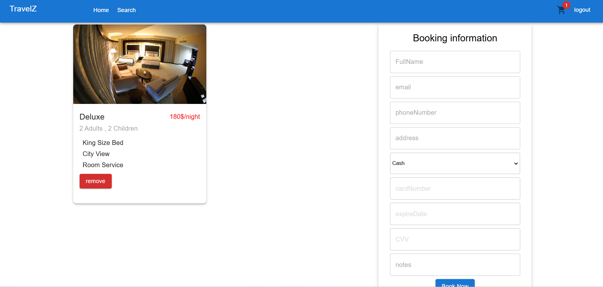

# 🌐 Travel and Accommodation Booking Platform

A web application that makes it easy for travelers to search, book, and manage accommodations. With a simple booking system, admins can easily manage cities, hotels, and rooms, ensuring a smooth experience for both travelers and admins.

--

## Technologies  
- **React**: A JavaScript library for building user interfaces.
- **React Router DOM**: Manages routing and navigation.  
- **React Query**: Efficient data fetching, caching, and state synchronization.  
- **Axios**: Handles HTTP requests for API communication.  
- **Material UI (MUI)**: Provides pre-styled, modern UI components.  
- **Date Range Picker**: Enhances date selection for hotel bookings.  
- **Formik**: Simplifies form handling and state management.  
- **Yup**: Schema validation for user inputs, ensuring data integrity.   
- **JWT Decode**: Safely decoding JWTs to extract user credentials and information.

---

## Features  

### 1️⃣ Login Page  
  

**User Login :**
username:user , password:user

**Admin Login :**
username:admin , password:admin

### 2️⃣ Home Page  
  

#### 2.1 Robust Search Functionality  

#### 2.2 Featured Deals Section  

#### 2.3 User’s Recently Visited Hotels  
    

#### 2.4 Trending Destination Highlights  
    

### 3️⃣ Search Results Page  
  

#### 3.1 Comprehensive Search Filters  
- Sidebar with filters for price range and amenities.  

#### 3.2 Hotel Listings  
- Listings of hotels matching search criteria.  

### 4️⃣ Hotel Page  

#### 4.1 Visual Gallery  
- Fullscreen viewable high-quality images of the hotel.  

#### 4.2 Detailed Hotel Information  
   

#### 4.3 Room Availability and Selection  
   

### 5️⃣ Checkout & Confirmation Page  

#### 5.1 User Information and Payment  
    
  
#### 5.2 Confirmation Page 
    

### 6️⃣ Admin Page for Easy Management  
  

  

  

